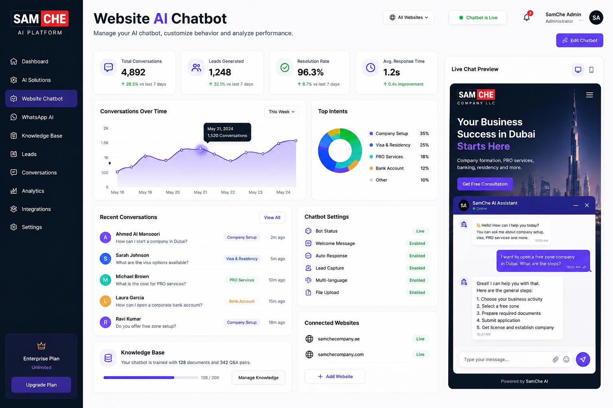
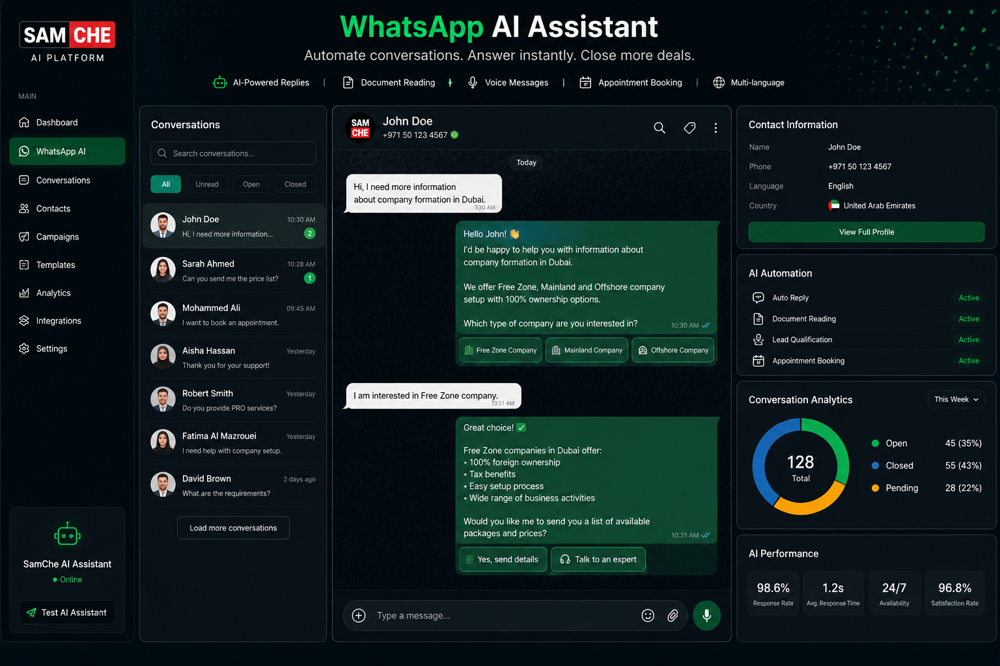
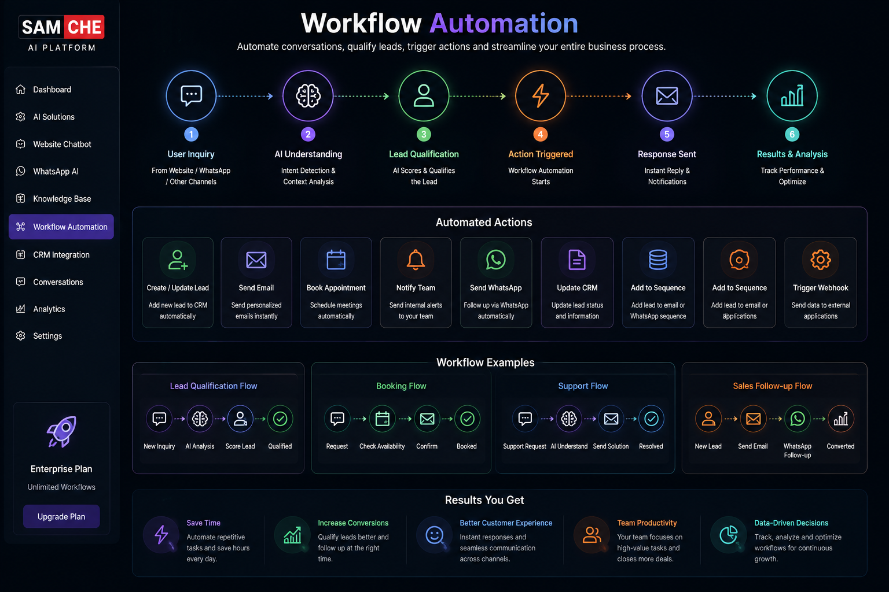
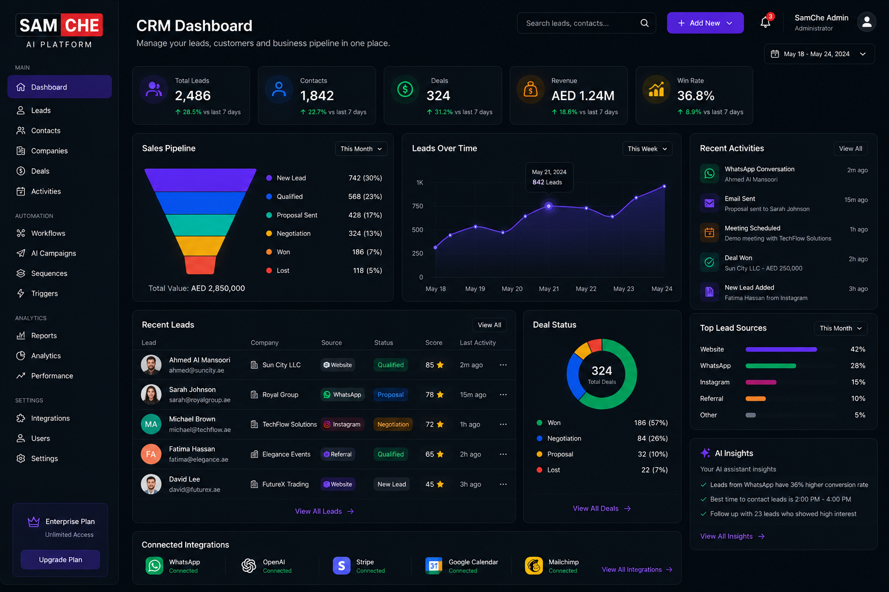
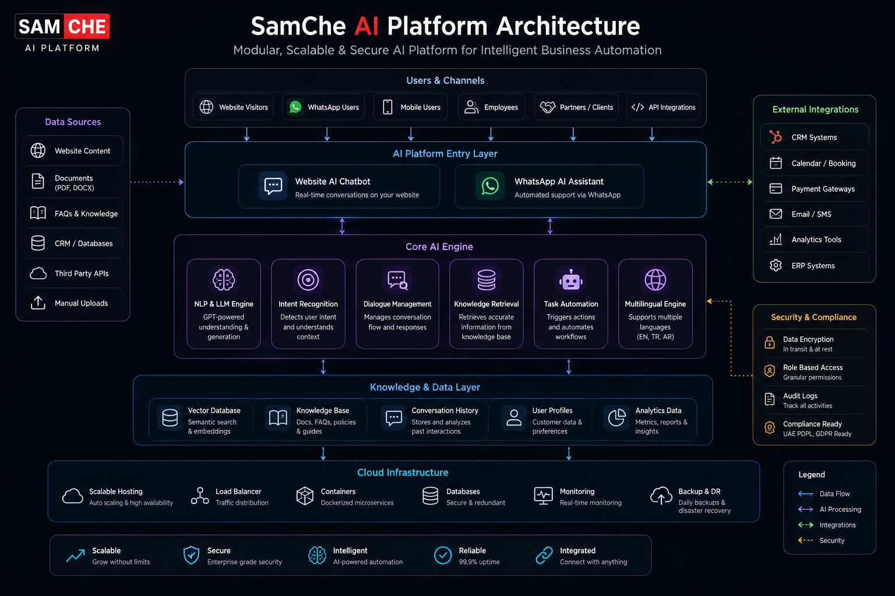

<p align="center">

</p>

<p align="center">


</p>


# SamChe AI Platform

Enterprise-grade Artificial Intelligence platform developed by **SamChe Company LLC** to automate customer engagement, optimize business operations, and accelerate digital transformation.

---

## Platform Overview

The **SamChe AI Platform** is a modular AI ecosystem built for businesses that want to automate customer communication, streamline internal workflows, and deliver intelligent support across multiple digital channels.

The platform combines conversational AI, WhatsApp automation, CRM connectivity, appointment scheduling, document intelligence, multilingual communication, workflow automation, and business analytics into one centralized solution.

Built with scalability in mind, the platform can be adapted to startups, SMEs, and enterprise organizations operating in different industries.

---

## Platform Preview

<p align="center">

</p>

The dashboard provides a centralized control panel where businesses can monitor customer interactions, AI performance, workflow automation, lead generation, and operational insights.

---

# Why SamChe AI?

Modern businesses require more than a chatbot.

They require an intelligent platform capable of understanding customer intent, automating repetitive operations, integrating with existing business systems, and continuously improving customer experience.

SamChe AI Platform has been designed around these principles.

### Key Benefits

- Enterprise-ready architecture
- GPT-powered AI conversations
- AI Website Chatbot
- WhatsApp AI Assistant
- AI Knowledge Base
- Voice AI Support
- CRM Integration
- Workflow Automation
- Appointment Scheduling
- Lead Qualification
- Business Analytics
- Secure Cloud Infrastructure
- Multi-language Support

---

# Core Products

The platform consists of multiple intelligent modules working together as one unified AI ecosystem.

---

## 🤖 AI Website Chatbot

Provide intelligent conversations directly from your website.

### Capabilities

- Natural language conversations
- Lead qualification
- FAQ automation
- Human handover
- Product recommendations
- Customer support
- Appointment booking

<p align="center">

</p>

---

## 💬 WhatsApp AI Assistant

Deliver fully automated customer communication through WhatsApp.

### Capabilities

- Instant AI replies
- Lead generation
- Smart customer support
- PDF understanding
- Voice message processing
- Booking management
- Sales assistance

<p align="center">

</p>

---

## 🧠 AI Knowledge Base

Build a centralized knowledge repository that allows AI to answer company-specific questions using your own documentation.

Capabilities include:

- Company documentation
- Internal policies
- FAQs
- Product catalogs
- Service information
- AI-powered semantic search

---

## 📅 Smart Appointment System

Allow customers to schedule appointments automatically through AI conversations.

Features include:

- Calendar integration
- Automatic reminders
- Booking confirmations
- Availability management
- Consultation requests

---

## ⚙️ Business Automation

Reduce repetitive manual tasks by automating everyday business operations.

<p align="center">

</p>

Automation examples include:

- Customer onboarding
- Lead routing
- Internal notifications
- CRM synchronization
- Follow-up automation
- Document processing

---
# ✨ Platform Features

The SamChe AI Platform combines artificial intelligence, automation, and enterprise integrations into one unified ecosystem.

| Module | Description |
|---------|-------------|
| 🤖 AI Chatbot | Human-like AI conversations for websites |
| 💬 WhatsApp AI | Intelligent WhatsApp automation |
| 📄 Document AI | PDF & document understanding |
| 🧠 Knowledge Base | Company-specific AI responses |
| 📅 Appointment Booking | AI-powered scheduling |
| 👥 Lead Qualification | Automatic customer qualification |
| 🔗 CRM Integration | Sync customers and leads |
| ⚙️ Workflow Automation | Business process automation |
| 📊 Analytics Dashboard | Business intelligence & reporting |
| 🌍 Multi-language | English • Türkçe • العربية |
| 🎤 Voice AI | Voice message understanding |
| 🔒 Enterprise Security | Secure cloud infrastructure |

---

# 🤝 CRM Integration

The platform connects seamlessly with CRM systems, enabling businesses to centralize customer information, automate follow-ups, and improve sales performance.

<p align="center">

</p>

### CRM Capabilities

- Customer management
- Lead synchronization
- Sales pipeline tracking
- Automated follow-ups
- Activity history
- Customer segmentation
- Opportunity management

---

# 🛠 Technology Stack

The SamChe AI Platform is built using modern cloud-native technologies and enterprise AI architecture.

## Artificial Intelligence

- Large Language Models (LLMs)
- Prompt Engineering
- Retrieval-Augmented Generation (RAG)
- AI Knowledge Base
- Semantic Search

## Communication Channels

- Website Chat
- WhatsApp Business
- Voice AI
- Live Chat

## Business Systems

- CRM Integration
- Booking Systems
- ERP Compatibility
- REST APIs
- Webhooks

## Infrastructure

- Cloud Deployment
- Secure API Gateway
- Authentication & Authorization
- Scalable Architecture
- Business Automation Engine

---

# 🏗 Platform Architecture

The platform follows a modular architecture designed to support enterprise scalability, high availability, and secure AI interactions.

<p align="center">

</p>

### Architecture Principles

- Modular AI Services
- Centralized Knowledge Base
- Multi-channel Communication
- Secure API Integrations
- Independent Service Layers
- Scalable Cloud Infrastructure

---

# 🏢 Industries

The SamChe AI Platform can be adapted to multiple industries.

| Industry | Typical Use Case |
|----------|------------------|
| Company Formation | Client onboarding & consultation |
| Real Estate | Property inquiries & lead qualification |
| Healthcare | Appointment scheduling & patient support |
| Hospitality | Guest communication |
| Restaurants | Reservations & customer service |
| Tourism | Booking assistance |
| Automotive | Sales & service automation |
| Professional Services | Client support & workflow automation |

---

# 📁 Repository Structure

```text
samche-ai-platform
│
├── README.md
├── LICENSE
├── assets
│   ├── banner.png
│   └── screenshots
│       ├── dashboard.png
│       ├── website-chat.png
│       ├── whatsapp-ai.png
│       ├── workflow.png
│       ├── crm.png
│       └── architecture.png
│
├── docs
│   ├── architecture.md
│   ├── features.md
│   ├── integrations.md
│   ├── security.md
│   ├── faq.md
│   ├── deployment.md
│   ├── api.md
│   └── roadmap.md
│
└── CHANGELOG.md
```

---

## 📈 Platform Highlights

- Enterprise-ready AI architecture
- Modular system design
- Multi-language communication
- AI-powered business automation
- CRM & workflow integrations
- Secure cloud deployment
- Designed for startups and enterprises
- Built for scalability

---
# 📚 Documentation

Comprehensive technical documentation is provided to help organizations understand the platform architecture, integrations, deployment strategy, and operational capabilities.

| Document | Description |
|----------|-------------|
| 🏗 Architecture | Platform architecture and system design |
| ⚙️ Features | Complete feature overview |
| 🔗 Integrations | Supported third-party integrations |
| 🔒 Security | Security model and best practices |
| ❓ FAQ | Frequently asked questions |
| 🚀 Deployment | Deployment recommendations |
| 📡 API | API overview and integration principles |
| 🗺 Roadmap | Planned improvements and future releases |

---

## Documentation Index

- 📄 [Architecture](./docs/architecture.md)
- 📄 [Features](./docs/features.md)
- 📄 [Integrations](./docs/integrations.md)
- 📄 [Security](./docs/security.md)
- 📄 [FAQ](./docs/faq.md)
- 📄 [Deployment](./docs/deployment.md)
- 📄 [API](./docs/api.md)
- 📄 [Roadmap](./docs/roadmap.md)

---

# 🌐 Integrations

The SamChe AI Platform has been designed with interoperability in mind.

The modular architecture allows businesses to integrate AI capabilities into existing business processes without replacing their current software ecosystem.

### Supported Integrations

| Category | Examples |
|----------|----------|
| CRM | CRM platforms |
| Messaging | WhatsApp Business |
| Calendar | Appointment systems |
| Email | Business email providers |
| Web | Company websites |
| Documents | PDF & internal knowledge |
| API | REST API & Webhooks |

---

## AI Communication Channels

The platform supports multiple communication channels through one centralized AI engine.

- Website Chat
- WhatsApp AI
- Voice AI
- Live Chat
- Contact Forms

Every interaction can be processed using the same centralized knowledge base and business rules.

---

## Business Integrations

Designed to work alongside existing business tools.

Capabilities include:

- Customer synchronization
- Lead routing
- Booking synchronization
- Contact management
- Workflow automation
- Notification systems

---

# 📡 API Overview

The platform exposes secure integration points that enable external applications to interact with AI services.

### Typical API Capabilities

- Send customer messages
- Receive AI responses
- Retrieve customer information
- Create appointments
- Update CRM records
- Trigger automation workflows
- Manage conversations

---

## Integration Principles

Every integration follows the same design principles.

- Secure authentication
- Modular architecture
- Scalable services
- Standardized communication
- High availability
- Business continuity

---

# 🚀 Deployment

The platform is designed for secure cloud deployment and enterprise scalability.

### Deployment Characteristics

- Cloud-native architecture
- Modular services
- High availability
- Scalable infrastructure
- Secure networking
- Centralized monitoring

---

## Deployment Workflow

1. Platform configuration
2. Knowledge Base preparation
3. CRM connection
4. AI behavior configuration
5. Communication channel integration
6. Internal testing
7. Production deployment
8. Performance monitoring

---

## Supported Business Scenarios

The platform can be configured for organizations operating in:

- Company Formation
- Real Estate
- Healthcare
- Hospitality
- Restaurants
- Tourism
- Automotive
- Professional Services
- Education
- Financial Services

---

## Enterprise Readiness

The platform has been designed with long-term operational stability in mind.

Key objectives include:

- Reliability
- Scalability
- Maintainability
- Security
- Extensibility
- Operational efficiency

---

# 🔒 Security

Security is a core design principle of the SamChe AI Platform.

Every component has been designed to support secure AI interactions, controlled data access, and reliable business operations.

---

## Security Principles

- Secure API communication
- Encrypted data transmission
- Role-based access control
- Authentication & authorization
- Audit logging
- Infrastructure isolation
- Least-privilege access
- Continuous monitoring

---

## Data Protection

The platform is designed to support responsible handling of business information.

### Protection Measures

- Secure communication channels
- Access control policies
- Session management
- Encrypted credentials
- Controlled permissions
- Backup strategies

---

## Authentication

Supported authentication approaches include:

- Secure Login
- API Keys
- OAuth-ready architecture
- Token-based authentication

---

## Infrastructure Security

Enterprise deployment focuses on:

- Cloud security
- Network isolation
- Secure storage
- Availability
- Disaster recovery planning

---

# 🛡 Privacy

The platform is designed to respect organizational privacy requirements.

Typical privacy objectives include:

- Data minimization
- Controlled access
- Business confidentiality
- Responsible AI usage

---

# 🏛 Compliance

Deployment can be adapted to support internal governance policies and organizational compliance requirements.

Examples include:

- Internal company policies
- Customer privacy policies
- Information security procedures
- Access management standards

---

# 📈 Reliability

The platform is engineered for continuous operation.

### Reliability Goals

- High availability
- Stable AI responses
- Consistent performance
- Fault tolerance
- Operational resilience

---

# ⚡ Performance

The modular architecture enables efficient resource utilization.

Platform objectives:

- Fast response times
- Scalable services
- Efficient workload distribution
- Optimized AI processing

---

# 💡 Best Practices

To achieve the best results, organizations are encouraged to:

- Maintain an up-to-date knowledge base.
- Review AI responses regularly.
- Keep integrations synchronized.
- Monitor operational metrics.
- Train internal teams on platform usage.

---

# ❓ Frequently Asked Questions

### Does the platform support multiple languages?

Yes.

The platform supports multilingual conversations including English, Turkish, and Arabic.

---

### Can the AI answer company-specific questions?

Yes.

The Knowledge Base allows the AI to respond using organization-specific information and documentation.

---

### Can the platform automate appointments?

Yes.

Appointments can be scheduled automatically through AI conversations.

---

### Does the platform integrate with CRM systems?

Yes.

Customer data and leads can be synchronized with compatible CRM solutions.

---

### Can workflows be automated?

Yes.

Business processes such as lead routing, follow-ups, notifications, and customer onboarding can be automated.

---

# 🤝 Support

SamChe Company provides professional implementation and ongoing platform support.

Support services include:

- Platform configuration
- AI optimization
- Integration assistance
- Knowledge Base preparation
- Business workflow consulting
- Continuous improvements

---

## Support Process

1. Initial consultation
2. Platform planning
3. Configuration
4. Integration
5. Testing
6. Go-live
7. Optimization
8. Continuous support

---

# 🌍 Availability

The platform is designed to support businesses operating internationally.

### Languages

- English
- Türkçe
- العربية

### Business Focus

- Startups
- SMEs
- Enterprise Organizations

---

# 📊 Platform Objectives

The SamChe AI Platform is continuously developed with the following objectives:

- Better customer engagement
- Higher automation
- Operational efficiency
- Business scalability
- Improved customer experience
- Intelligent decision support

---
# 🗺 Product Roadmap

The SamChe AI Platform is continuously evolving to provide smarter automation, broader integrations, and enterprise-ready AI capabilities.

| Status | Feature |
|--------|---------|
| ✅ Available | AI Website Chatbot |
| ✅ Available | WhatsApp AI Assistant |
| ✅ Available | AI Knowledge Base |
| ✅ Available | CRM Integration |
| ✅ Available | Workflow Automation |
| ✅ Available | Appointment Scheduling |
| 🚧 In Progress | AI Voice Assistant |
| 🚧 In Progress | Advanced Analytics Dashboard |
| 🚧 In Progress | Mobile Management Dashboard |
| 📅 Planned | AI Sales Assistant |
| 📅 Planned | Additional CRM Connectors |
| 📅 Planned | Expanded API Ecosystem |

---

# 🚀 Why SamChe Company

SamChe Company LLC develops practical AI solutions that help organizations improve customer experience, automate repetitive processes, and increase operational efficiency.

Rather than offering generic automation tools, every implementation is designed around the client's business model, communication workflow, and operational requirements.

Our objective is to deliver AI solutions that create measurable business value while remaining simple to manage and scalable for future growth.

---

# 🌍 Our Mission

To make enterprise-grade Artificial Intelligence accessible for businesses of every size.

We believe AI should simplify business operations, strengthen customer relationships, and enable sustainable digital transformation.

---

# 🌐 Industries We Serve

The platform can be adapted for many industries, including:

- Company Formation
- Real Estate
- Healthcare
- Hospitality
- Restaurants
- Tourism
- Automotive
- Professional Services
- Education
- Financial Services

---

# 📞 Contact

**SamChe Company LLC**

🌐 Website  
https://samchecompany.com

📧 Email  
business@samchecompany.com

📍 Location  
Dubai, United Arab Emirates

💼 LinkedIn  
https://www.linkedin.com/company/samche-company-llc

---

# 🤝 Professional Services

In addition to the SamChe AI Platform, our team provides:

- AI Strategy Consulting
- AI Chatbot Development
- WhatsApp Business Automation
- CRM Integrations
- Workflow Automation
- Company Formation Consultancy (UAE)
- Digital Transformation Consulting

---

# 📄 License

Copyright © SamChe Company LLC.

All rights reserved.

This repository is provided for documentation and informational purposes only.

No part of this repository may be copied, redistributed, modified, or used for commercial purposes without prior written permission from SamChe Company LLC.

For licensing inquiries, please contact:

business@samchecompany.com

---

<p align="center">

**SamChe AI Platform**

Enterprise Artificial Intelligence for Modern Businesses

Developed with ❤️ by **SamChe Company LLC**

Dubai • United Arab Emirates

</p>


