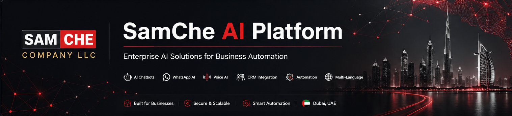

  

 

# SamChe AI Platform

Enterprise AI solutions developed by **SamChe Company LLC** to help businesses automate customer communication, streamline operations, and accelerate growth.

---

## About

SamChe AI Platform is a business-focused artificial intelligence ecosystem designed for companies looking to automate customer interactions and internal workflows.

Our platform combines AI chatbots, WhatsApp automation, multilingual support, CRM integrations, document processing, appointment scheduling, and business intelligence into one scalable solution.

---

## Core Solutions

- AI Website Chatbot
- WhatsApp AI Assistant
- Voice AI
- CRM Integration
- AI Knowledge Base
- Lead Qualification
- Appointment Booking
- Multi-language AI (English • Türkçe • العربية)

---

## Industries

- Company Formation
- Real Estate
- Healthcare
- Restaurants
- Hotels
- Tourism
- Automotive
- Professional Services

---

## Website

https://samchecompany.com

---

## Company

SamChe Company LLC  
Dubai, United Arab Emirates
