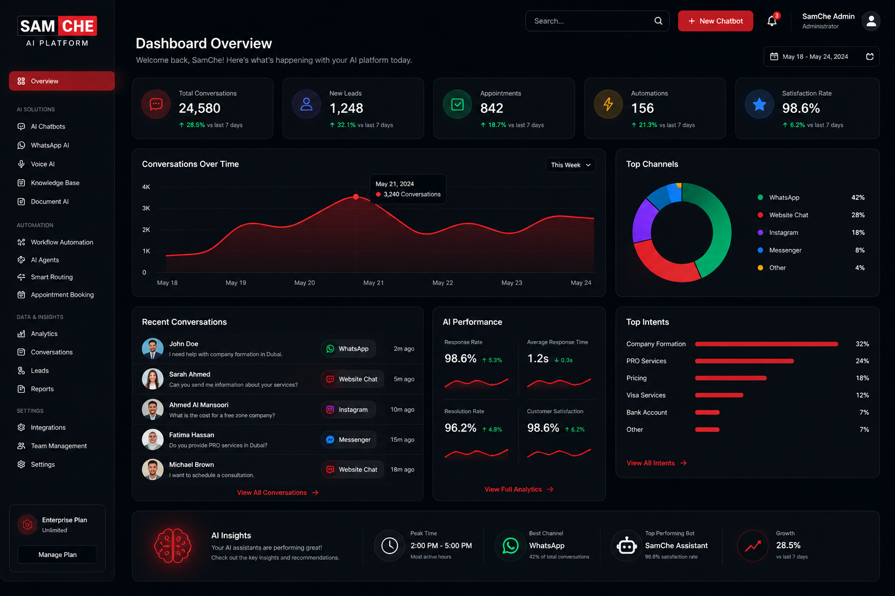

  

 

# 🚀 SamChe AI Platform

Enterprise-grade Artificial Intelligence solutions developed by **SamChe Company LLC** for businesses seeking intelligent automation, enhanced customer engagement, and scalable digital transformation.

---

## Transforming Businesses with AI

The **SamChe AI Platform** is a modular AI ecosystem that empowers companies to automate customer communication, optimize business workflows, and provide intelligent 24/7 support across multiple digital channels.

Designed for organizations of all sizes, our platform integrates conversational AI, business automation, CRM connectivity, multilingual communication, knowledge management, and operational intelligence into one centralized solution.

Whether your business operates in **real estate, healthcare, hospitality, retail, legal services, or company formation**, the SamChe AI Platform adapts to your workflows with enterprise-level flexibility.

  

---

## Why Choose SamChe AI?

✔ Enterprise-grade AI architecture

✔ Designed for business automation

✔ GPT-powered conversational intelligence

✔ Multi-language support (English • Türkçe • العربية)

✔ CRM & ERP integrations

✔ WhatsApp AI Assistant

✔ Website AI Chatbot

✔ Appointment automation

✔ Lead qualification

✔ Knowledge Base AI

✔ Secure cloud infrastructure

✔ Scalable for startups and enterprises

---

## Table of Contents

- About
- Core Solutions
- Features
- Industries
- Technology
- Security
- Documentation
- Roadmap
- Contact

## Core Solutions
---

# ✨ Platform Features

| Feature | Description |
|----------|-------------|
| 🤖 AI Chatbot | GPT-powered customer communication |
| 💬 WhatsApp AI | 24/7 intelligent WhatsApp assistant |
| 🌐 Website Chat | AI-powered website conversations |
| 📄 Document AI | Reads PDFs and company documents |
| 🎤 Voice AI | Voice message understanding |
| 🌍 Multi-language | English • Türkçe • العربية |
| 📅 Booking System | AI appointment scheduling |
| 👥 Lead Qualification | Smart customer qualification |
| 📊 Analytics | Customer insights & reporting |
| 🔗 CRM Integration | Connect with your CRM |
| ⚙️ Workflow Automation | Business process automation |
| 🔒 Enterprise Security | Secure cloud infrastructure |

---

# 🛠 Technology Stack

The SamChe AI Platform is designed with modern AI and cloud technologies.

## 📸 Platform Preview

Dashboard

WhatsApp AI

Website Chat

Analytics

### Artificial Intelligence

- Large Language Models (LLMs)
- Retrieval-Augmented Generation (RAG)
- Prompt Engineering
- AI Knowledge Base

### Integrations

- WhatsApp Business
- Website Chat Widgets
- CRM Systems
- Booking Systems
- REST APIs

### Infrastructure

- Cloud Deployment
- Secure API Architecture
- Scalable Services
- Business Automation

---

## 🏗 Platform Architecture

SamChe AI Platform is built around modular AI services.

AI Engine
        ↓
Knowledge Base
        ↓
WhatsApp
Website Chat
Voice AI
CRM
Booking
Analytics

# 🗺 Roadmap

## Current

- ✅ AI Chatbot
- ✅ WhatsApp AI
- ✅ Website Chat
- ✅ CRM Integration

## Upcoming

- AI Voice Assistant
- Mobile Dashboard
- AI Sales Agent
- AI Analytics
- Additional CRM Connectors
- Advanced Workflow Automation

### 🤖 AI Website Chatbot

An intelligent virtual assistant capable of understanding customer requests, answering questions, qualifying leads, and providing real-time support.

---

### 💬 WhatsApp AI Assistant

A fully automated AI assistant for WhatsApp capable of handling customer inquiries, booking appointments, reading documents, processing voice messages, and generating sales opportunities.

---

### 🧠 AI Knowledge Base

Centralized knowledge management enabling AI to answer company-specific questions using internal documentation, FAQs, and business data.

---

### 📅 Smart Appointment System

Automated booking system integrated with AI conversations to schedule meetings and consultations without manual intervention.

---

### 📊 Business Automation

Workflow automation designed to reduce repetitive tasks while increasing operational efficiency.

---

# 📞 Contact

**SamChe Company LLC**

🌍 Website  
https://samchecompany.com

📧 Email  
business@samchecompany.com

📍 Location  
Dubai, United Arab Emirates

LinkedIn  
https://www.linkedin.com/company/samche-company-llc

---

© 2026 SamChe Company LLC. All rights reserved.
